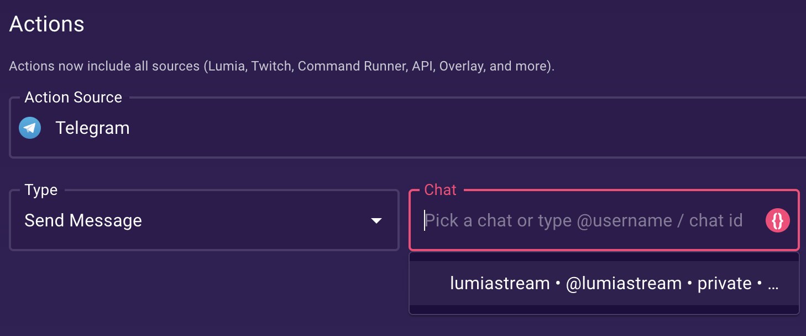

### Actions

- **Send Message**: Send a message to a chat (uses Default Chat ID if not provided).
  - The Chat dropdown auto-fills from recent incoming messages.
  - In user mode, it also tries to pull your dialog list when you open the action.
  - If the list is empty, type a value manually: `@username` or a numeric chat ID.
  - Bot mode requires the user to message the bot first (or add the bot to a group).

