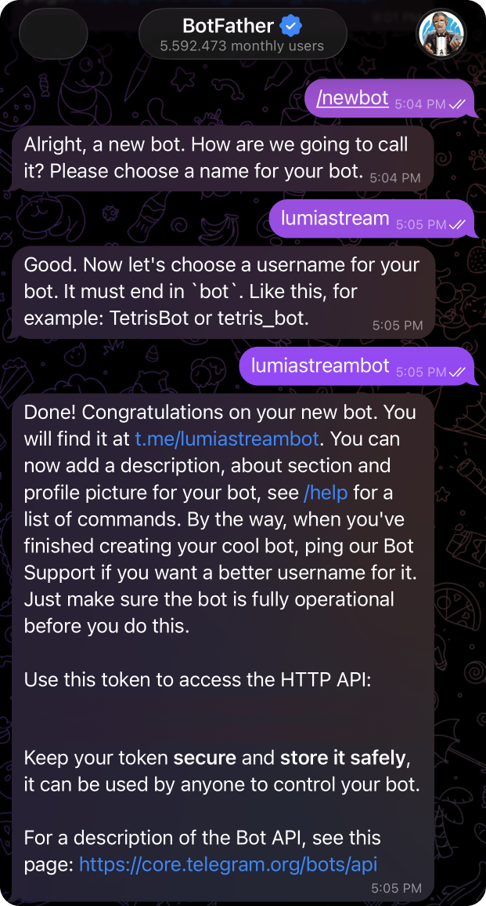
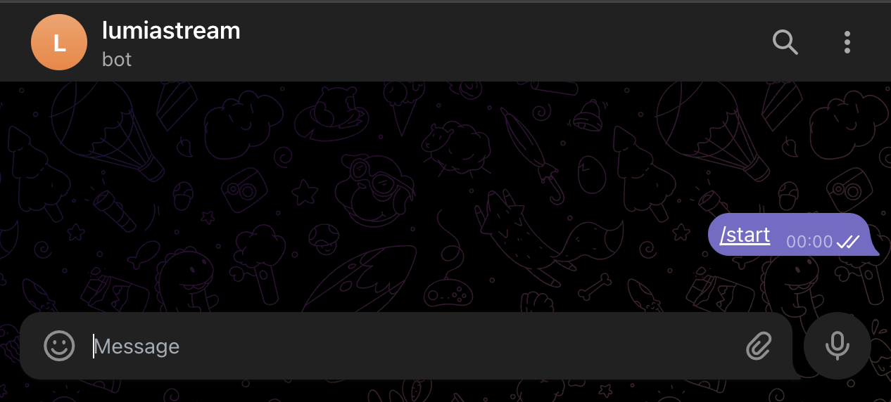

# Telegram Integration (Quick Setup)

## 1. Choose Authentication Mode

Pick one:

**Bot (Recommended)** (BotFather token) automation & alerts using a Telegram bot.

**Lumia App** (managed credentials) connects using your personal Telegram account.

**Your App** (API ID + hash) advanced setup with your own Telegram API
credentials.

---

## 2. Bot Mode (Recommended)

### Setup

1.  Open **[@BotFather](https://t.me/BotFather)** on Telegram.
2.  Run: /newbot
3.  Create the bot and copy the **Bot Token**.
4.  Paste the token into the plugin settings.

### Activate the Bot

Bots cannot start conversations.

You must: - Send `/start` to the bot, **or** - Add the bot to a group
and send a message.

After the first message: ✅ Chat dropdown in the action send message will populate automatically with your chat.

### Test

Use **Send Message** action → pick a chat → send a test message.

### Chat ID

After a message is received:

    telegram_chat_id

will be available in plugin variables.

---

## 3. Lumia App Mode

1.  Enter your phone number.
2.  Click **Verify** to request a code and enter it in the popup (no Save required).
3.  If you use Telegram 2FA, enter your password when prompted.

Your chats will load automatically.

---

## 4. Your App Mode (Advanced)

1.  Go to [my.telegram.org](https://my.telegram.org)
2.  Create an application.
3.  Copy:
    - api_id
    - api_hash
4.  Paste into plugin settings.

5.  Enter your phone number and click **Verify** to request a code and enter it in the popup.

(Optional) Add a session string to avoid future login codes.

---

## 5. Default Chat ID

Set a Default Chat ID if actions should send messages automatically
without choosing a chat each time.

Priority: Action Chat → Default Chat → Last Active Chat

---

## Notes

- Bots cannot message users first.
- Disable bot privacy mode for group message reading.
- Login codes are single‑use and expire quickly.
- Keep tokens and credentials private.

---

## Troubleshooting

**Chat list empty** - Send `/start` to the bot. - Check token validity.

**Messages not received** - Disable privacy mode. - Ensure bot
permissions.

**Login loop** - Click **Verify** to request a new login code.

---

## Modes Overview

**Bot (BotFather token) - Recommended**  
Chats as a bot. The bot can only message users who started a chat with it or groups/channels it was added to. It cannot message your personal chats directly.

**Lumia App (managed credentials)** or **Your App (API ID + hash)**  
Uses your personal Telegram account. Can message any chat you can access in your Telegram app.
