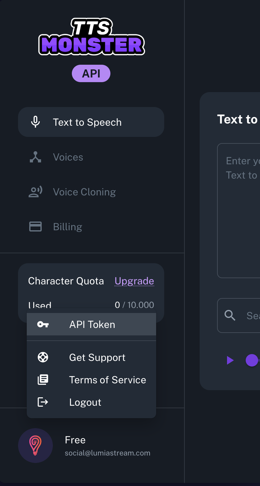

---
### 1) Create A TTS.Monster API Token
1. Open the [TTS.Monster Console](https://console.tts.monster/).
2. Log in and click through to create or copy your API token.
3. Paste that token into this plugin's **API Token** setting.

---
