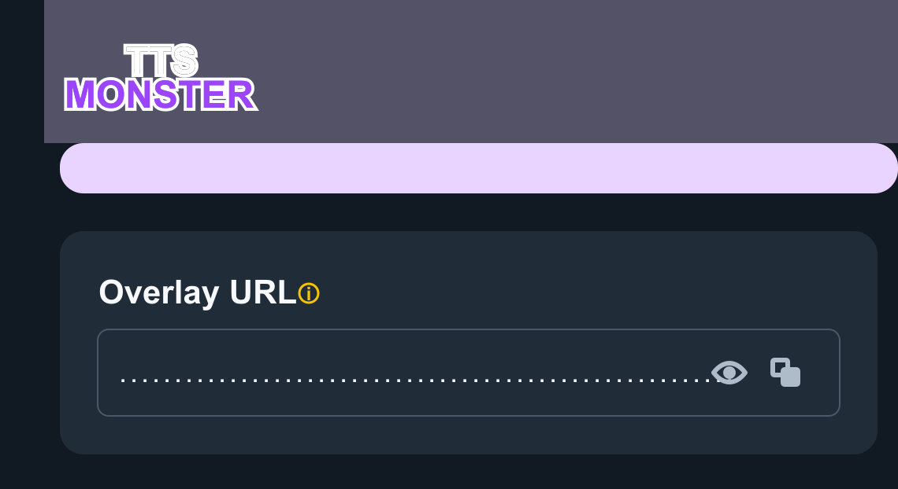
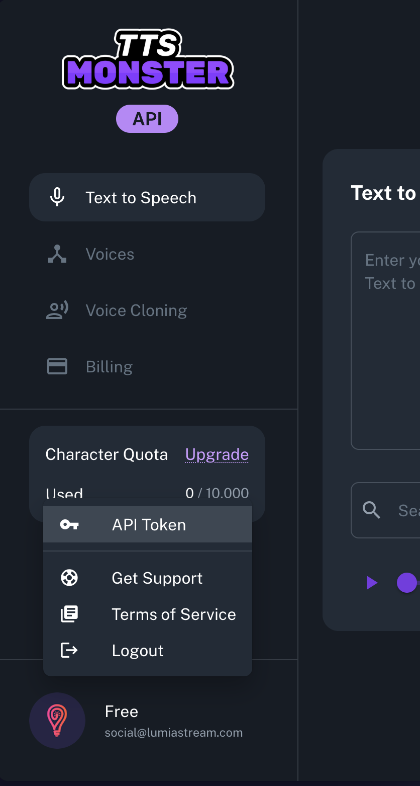

---
### Connect TTS.Monster

#### Overlay URL
1. Set **Connection Method** to **Overlay URL**.
2. Open the [TTS.Monster dashboard](https://tts.monster/dashboard/app).
3. Copy your full **Overlay URL**.
4. Paste it into this plugin's **Overlay URL** setting.

Example overlay URL:
`https://tts.monster/overlay/3hoZh83Uigewkx0Upw66imx2ASj1/059e9e17a7c64a42b38b6bbf7b40bee3`

#### Developer API Token
1. Set **Connection Method** to **Developer API Token**.
2. Open the [TTS.Monster Console](https://console.tts.monster/).
3. Log in and click through to create or copy your API token.
4. Paste that token into this plugin's **API Token** setting.

---
