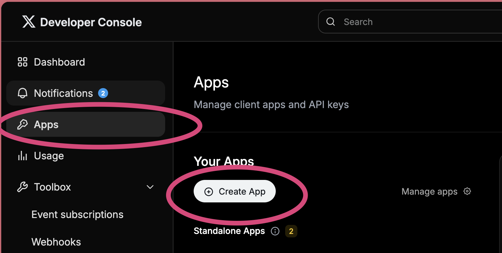
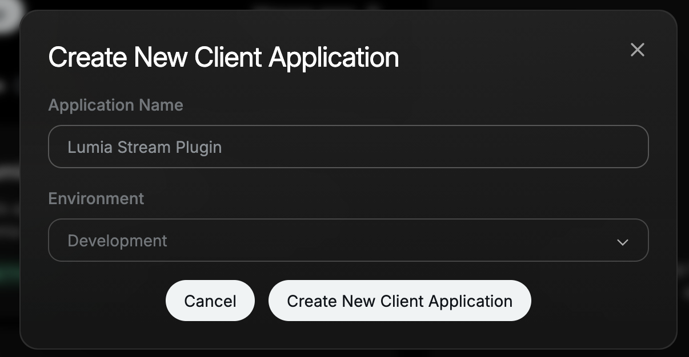
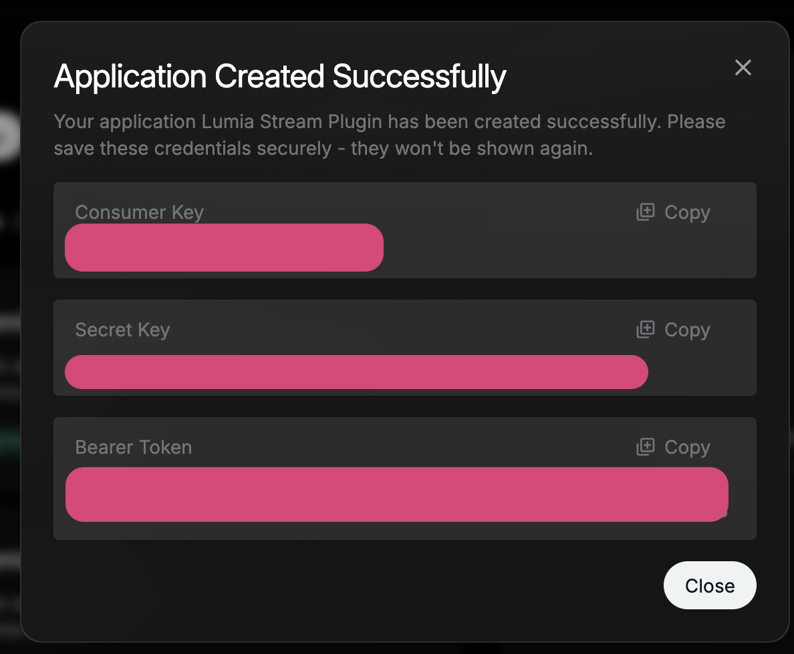
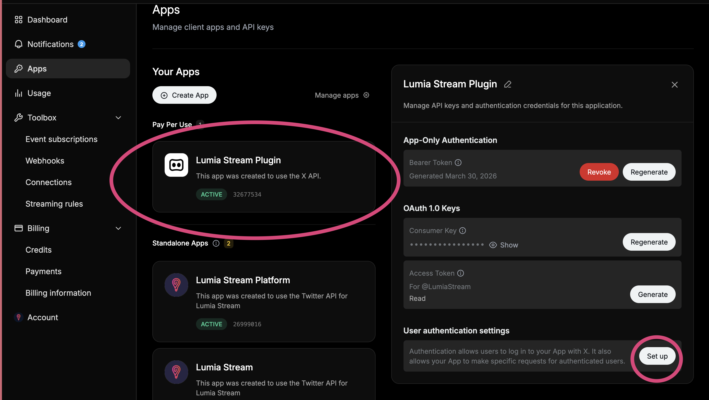
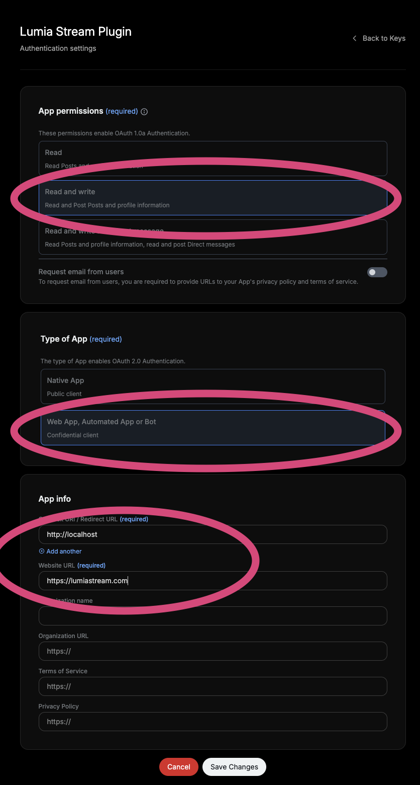
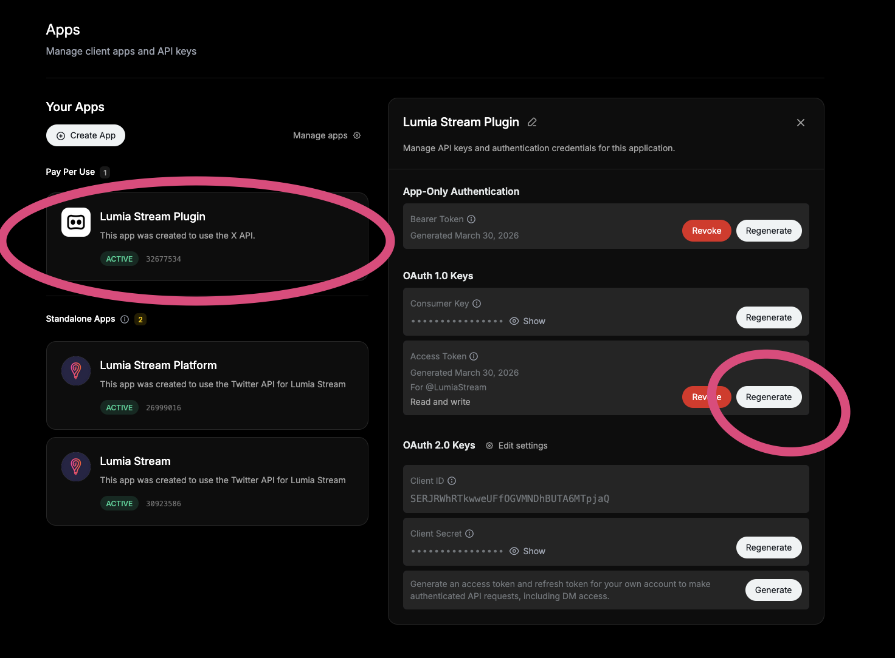
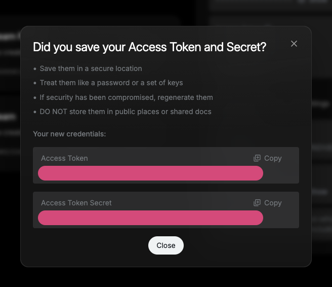
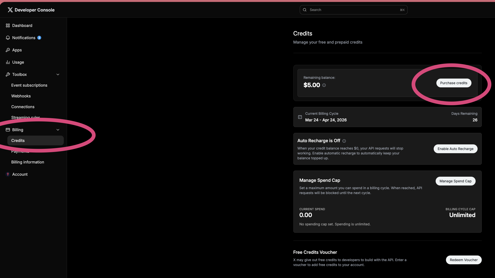
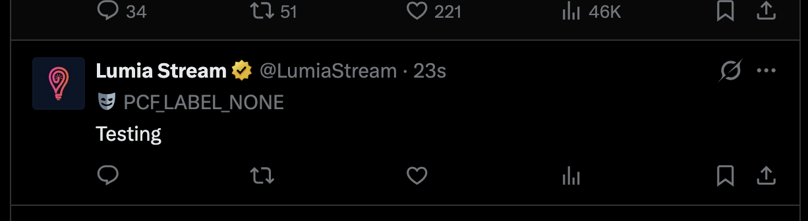

### Setup

This plugin uses your own X developer app credentials. Lumia does not proxy requests for you, so you need to create your own X app once and paste the keys into the plugin.

### Step-by-Step

1. Open the [X Developer Console](https://console.x.com/), sign in, click **Apps** in the left sidebar, then click **Create App**.

2. In the **Create New Client Application** window:
   - enter any app name you want
   - leave **Environment** set to `Development`
   - click **Create New Client Application**

3. X will immediately show the first set of credentials. Copy and save these now:
   - `Consumer Key`
   - `Secret Key`

You only get one clean copy popup here, so save them somewhere safe before closing the window.

4. Back on the app page, click your new app, then click **Set up** in the **User authentication settings** section.

5. Configure authentication like this, then click **Save Changes**:
   - **App permissions**: `Read and write`
   - **Type of App**: `Web App, Automated App or Bot`
   - **Callback / Redirect URI**: `http://localhost`
   - **Website URL**: any valid URL you control, or a harmless placeholder such as `https://lumiastream.com`

If X shows extra optional fields below that, they can stay empty unless your account requires them.

6. Return to the app's key page. You should be back on the screen that shows the app keys and the **OAuth 1.0 Keys** section. From here:
   - reveal or copy the `Consumer Key` if you have not already saved it
   - click the button next to **Access Token** to generate the user token

7. X will then show the second set of credentials. Copy and save these too:
   - `Access Token`
   - `Access Token Secret`

At the end of this step you should have all four values the Lumia plugin needs.

8. Before testing posts, make sure the app has credits. In the X Developer Console go to:
   - **Billing**
   - **Credits**
   - **Purchase credits**

Without credits, write requests can fail even if the keys are correct.

9. Back in Lumia, open the X plugin settings and paste the four saved values into:
   - **Consumer Key**
   - **Consumer Secret**
   - **Access Token**
   - **Access Token Secret**

10. Optional: fill in **Expected Username** if you want Lumia to verify that the token belongs to the account you expect.

11. By default, **Enable Alerts** is turned off. This is intentional so the plugin does not spend X API credits on background read requests until you explicitly want alerts.

12. If you want follower or mention alerts later, go to the **Alerts** tab in the plugin settings, then manually turn on:
   - **Enable Alerts**
   - the specific alert types you want
   - the polling interval you are comfortable paying for

13. Save the plugin settings. Then test it with the **Create Post** action. A successful test should publish a post like the example below.

### Costs and Credit Usage

As of March 30, 2026, X's public docs say the API uses pay-per-usage pricing and that exact prices vary by endpoint. X does not publish a simple fixed dollar table in the docs, so you need to check your live rates in the Developer Console:

- [Pricing](https://docs.x.com/x-api/getting-started/pricing)
- [Usage and Billing](https://docs.x.com/x-api/fundamentals/post-cap)
- [Usage API](https://docs.x.com/x-api/usage/introduction)

### What Each Action Uses

- **Create Post** without media: `1` write request (`POST /2/tweets`)
- **Create Post** with one image: `2` requests (`POST /2/media/upload` + `POST /2/tweets`)
- **Create Post** with one video: variable, but more expensive than an image post because it uses chunked media upload before the final post create call
- **Delete Post**: `1` write request (`DELETE /2/tweets/:id`)
- **Delete Latest Created Post**: `1` write request (`DELETE /2/tweets/:id`)
- **Like Post**: `1` write request (`POST /2/users/:id/likes`)
- **Repost Post**: `1` write request (`POST /2/users/:id/retweets`)
- **Follow User** by numeric user ID: `1` write request (`POST /2/users/:id/following`)
- **Follow User** by username/handle: `2` requests because the plugin first resolves the username, then follows that user

### What Alerts Use

- If **Enable Alerts** is off: `0` background read requests
- If **Enable Alerts** is on and at least one alert type is enabled, the current plugin poll cycle makes `3` read requests each time:
- `GET /2/users/me`
- `GET /2/users/{id}/tweets`
- `GET /2/users/{id}/mentions`

### Poll Interval Examples

- `300` seconds: `288` polls/day = `864` API requests/day
- `60` seconds: `1,440` polls/day = `4,320` API requests/day
- `15` seconds: `5,760` polls/day = `17,280` API requests/day

### Important Billing Notes

- X says **User posts** and **User mentions** timeline endpoints count toward Post usage tracking.
- X says billable resources are usually deduplicated within a `24-hour UTC` window, so repeatedly seeing the same returned Post in one day usually does not bill again.
- X says failed requests do **not** count toward billing.
- The safest way to measure real cost is to keep alerts off at first, test one action at a time, then watch your **Usage** page in the Developer Console.

### Notes

- The plugin uses OAuth 1.0a style user tokens, so you need all four values above.
- Alerts are disabled by default so the plugin does not spend read credits unless you manually turn them on.
- If you enable mention or follower alerts later, the plugin will begin polling X on the interval you choose.
